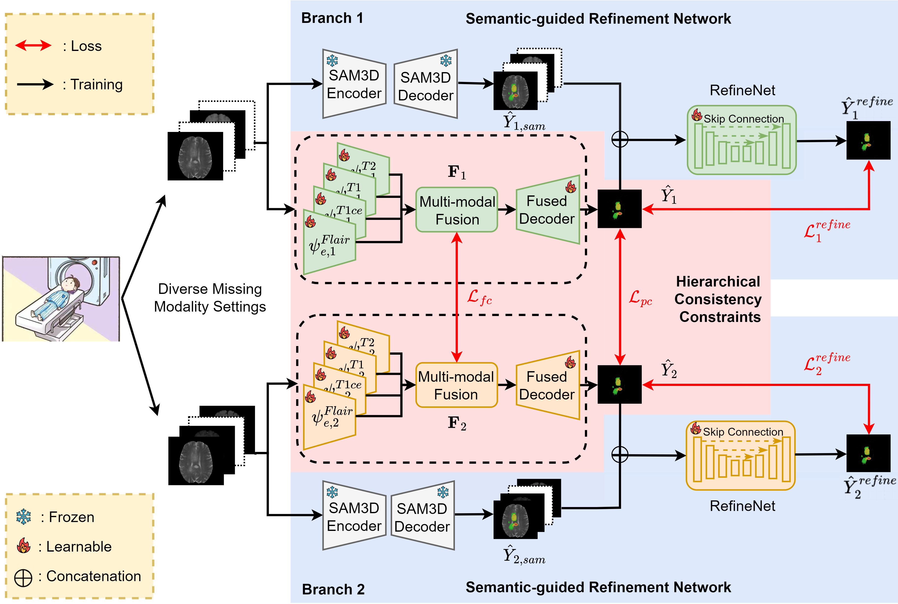

# SMML: Semantic-guided Masked Mutual Learning for Multi-modal Brain Tumor Segmentation with Arbitrary Missing Modalities (AAAI 2025)

This is the implementation for the paper:

[Semantic-guided Masked Mutual Learning for Multi-modal Brain Tumor Segmentation with Arbitrary Missing Modalities](https://arxiv.org/abs/2206.02425)

Accepted to AAAI 2025 

## Abstract
Malignant brain tumors have become an aggressive and dangerous disease that leads to death worldwide. Multi-modal MRI data is crucial for accurate brain tumor segmentation, but missing modalities common in clinical practice can severely degrade the segmentation performance. While incomplete multi-modal learning methods attempt to address this, learning robust and discriminative features from arbitrary missing modalities remains challenging. To address this challenge, we propose a novel Semantic-guided Masked Mutual Learning (SMML) approach to distill robust and discriminative knowledge across diverse missing modality scenarios. Speciffcally, we propose a novel dual-branch masked mutual learning scheme guided by Hierarchical Consistency Constraints (HCC) to ensure multi-level consistency, thereby enhancing mutual learning in incomplete multi-modal scenarios. The HCC framework comprises a pixel-level constraint that selects and exchanges reliable knowledge to guide the mutual learning process. Additionally, it includes a featurelevel constraint that uncovers robust inter-sample and interclass relational knowledge within the latent feature space. To further enhance multi-modal learning from missing modality data, we integrate a reffnement network into each student branch. This network leverages semantic priors from the Segment Anything Model (SAM) to provide supplementary information, effectively complementing the masked mutual learning strategy in capturing auxiliary discriminative knowledge. Extensive experiments on three challenging brain tumor segmentation datasets demonstrate that our method signiffcantly improves performance over state-of-the-art methods in diverse missing modality settings.

## Architecture overview of SMML


## Usage. 

* Environment Preparation

```bash
conda create --name SMML python=3.9
conda activate SMML
```
### 3.Install other dependencies
```bash
pip install -r requirements.txt
```

* Data Preparation
  * Datasets Brain Tumor Segmentation (BraTS) Challenge 2015/2018/2020 ([BraTS2015](https://www.kaggle.com/datasets/xxc025/brats2015)/[BraTS2018](https://www.med.upenn.edu/sbia/brats2018.html)/[BraTS2020](https://www.med.upenn.edu/cbica/brats2020/)).
  * Set the data path in `preprocess.py` and then run `python preprocess.py`.
  * Set the data path in `job_{dataset}.sh`.
* Train
  * Train the model by `sh job_{dataset}.sh`. 

* Test
  * The trained model should be located in `./output_{dataset}`. 
  * Uncomment the evaluation command in  `job_{dataset}.sh` and then inference on the test data by `sh job_{dataset}.sh`.

## Citation

If you find this code and paper useful for your research, please kindly cite our paper.

```
@misc{liang2025semanticguidedmaskedmutuallearning,
      title={Semantic-guided Masked Mutual Learning for Multi-modal Brain Tumor Segmentation with Arbitrary Missing Modalities}, 
      author={Guoyan Liang and Qin Zhou and Jingyuan Chen and Bingcang Huang and Kai Chen and Lin Gu and Zhe Wang and Sai Wu and Chang Yao},
      year={2025},
      eprint={2507.07592},
      archivePrefix={arXiv},
      primaryClass={stat.ME},
      url={https://arxiv.org/abs/2507.07592}, 
}
```

## Reference

* [mmFormer](https://github.com/YaoZhang93/mmFormer)
* [RFNet](https://github.com/dyh127/RFNet)

